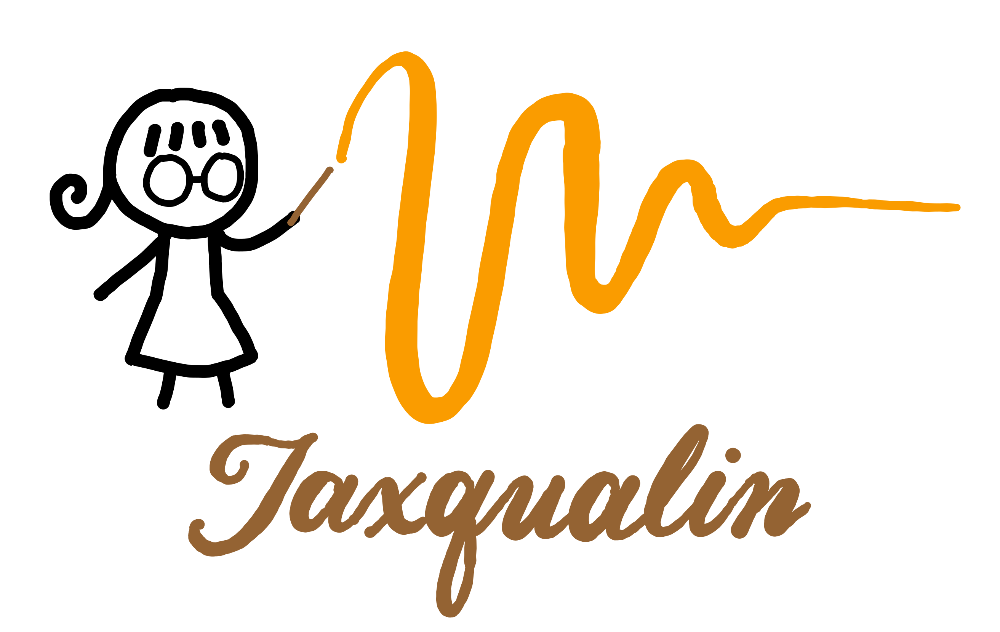

<h1 align="center">
    
</h1>

<h4 align="center"> A python package for extracting quasinormal modes from black-hole ringdown simulations.</h4>

<p align="center">
    <a href = "https://arxiv.org/abs/2310.04489"></a>
    <a href="https://badge.fury.io/py/jaxqualin"></a>
    <a href="https://github.com/mhycheung/jaxqualin/actions/workflows/pytest.yml"></a>
    <a href="https://github.com/mhycheung/jaxqualin/blob/main/LICENSE"></a>
    <a href="https://mhycheung.github.io/jaxqualin/"></a>
    <a href="https://pypi.org/project/jaxqualin/"></a>
</p>

<p align="center">
  <a href="#key-features">Key Features</a> •
  <a href="#installation">Installation</a> •
  <a href="#usage">Usage</a> •
  <a href="#paper-results">Paper Results</a> •
  <a href="#how-to-cite">How to Cite</a> •
  <a href="#license">License</a> 
</p>

## Key Features

- Fit ringdown waveforms with quasinormal modes (QNMs) using fixed frequencies, free frequencies, or mixed setups
- [JAX](https://github.com/jax-ml/jax)-accelerated nonlinear least-squares fitting with variable projection (VARPRO) and [Optimistix](https://github.com/patrick-kidger/optimistix)-based optimization
- Flexible QNM model fitting for remnant-parameter inference (`M`, `a`) and custom parametric models
- Custom mode and model framework for user-defined mode content beyond standard Kerr QNMs
- Agnostic mode identification and stability-based mode selection across varying fit start times
- Save/reuse fit outputs with `pickle`, and visualize amplitudes/phases with built-in plotting tools
- Call hyperfit polynomials to approximate QNM amplitudes in the ringdown of binary black hole (BBH) mergers

## Installation

```shell
pip install jaxqualin
```

## Usage

Basic usage examples can be found under the Examples tab on the [package homepage](https://mhycheung.github.io/jaxqualin/).

## Paper Results

Interactive plots of the methods paper results can be found under the Results tab on the [package homepage](https://mhycheung.github.io/jaxqualin/).

## How to Cite

Please cite the methods paper if you used our package to produce results in your publication.
Here is the BibTeX entry:

```
@article{Cheung:2023vki,
    author = "Cheung, Mark Ho-Yeuk and Berti, Emanuele and Baibhav, Vishal and Cotesta, Roberto",
    title = "{Extracting linear and nonlinear quasinormal modes from black hole merger simulations}",
    eprint = "2310.04489",
    archivePrefix = "arXiv",
    primaryClass = "gr-qc",
    doi = "10.1103/PhysRevD.109.044069",
    journal = "Phys. Rev. D",
    volume = "109",
    number = "4",
    pages = "044069",
    year = "2024",
    note = "[Erratum: Phys.Rev.D 110, 049902 (2024), Erratum: Phys.Rev.D 112, 049901 (2025)]"
}
```

## License

MIT

---

> GitHub [@mhycheung](https://github.com/mhycheung)

