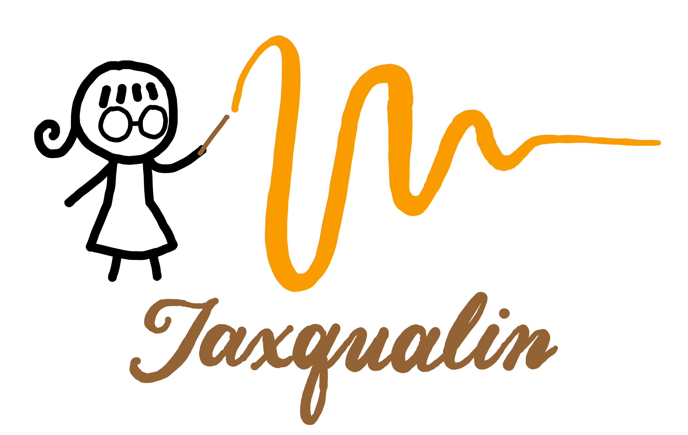

<h1 align="center">
    
</h1>

<h4 align="center"> A python package for extracting quasinormal modes from black-hole ringdown simulations.</h4>

<p align="center">
    <a href = ""></a>
    <a href="https://badge.fury.io/py/jaxqualin"></a>
    <a href="https://github.com/mhycheung/jaxqualin/actions/workflows/pytest.yml"></a>
    <a href="https://github.com/mhycheung/jaxqualin/blob/main/LICENSE"></a>
</p>

## Key Features

* Fit a ringdown waveform with quasinormal modes (QNMs) of fixed or free frequencies
* Nonlinear least-squares fitting with automatic differentiation via <a href="https://github.com/Dipolar-Quantum-Gases/jaxfit">JaxFit</a>
* Agnostic identification of QNMs within the waveform
* Saving and reusing results with pickle
* Easy visualization of results
* Call hyperfit models of QNM amplitudes in the ringdown of binary black hole (BBH) mergers

## Installation

```shell
pip install jaxqualin
```

## Usage

Basic usage of the package are showcased under the Examples tab on the left.

> **Note**
> We did not extensively test and do not recommend running `jaxqualin` on a GPU

## Paper Results

Interactive plots of the methods paper can be found under the Results tab on the left.

## Coming Soon

* Full API
* Support for real (Schwarzshild) ringdown waveforms
* Fitting for the mass and spin of the remnant
* Fitting the (noiseless) detector response 

## License

MIT

---

> GitHub [@mhycheung](https://github.com/mhycheung)