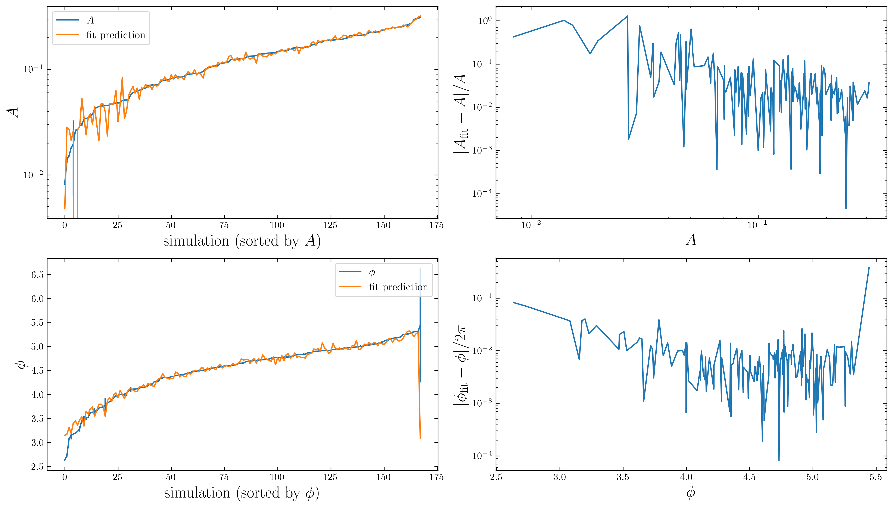

# 2,1,0 mode

## Fit expressions

The hyperfit expressions should be used with caution, especially in regions of low amplitude or outside of the convex hull of the data points.
The hyperfit function for the amplitude could go to negative values in these regions, which is unphysical.
The phase data has been unwrapped before fitting to the best of our ability, but there may still be some jumps of $2\pi$ in the data, which could be seen in the error plot.
Please consult the fit error plot on the bottom of this page before using the fits.

We also recommend checking the hyperfit results against the interpolated results. 
Please check the example notebook under the Examples tab.

#### Amplitude
$$\begin{aligned}
A_{2{,}1{,}0} = & \ 1.827 - 1.306 \chi_- + 2.247 \chi_-^2 - 36.8 \eta \chi_-^2 \\ 
 & - 2.713 \chi_+^3 + 3.122 \chi_+^2 \chi_- - 567 \eta^4 - 42.68 \eta^3 \chi_+ \\ 
 & + 132.1 \eta^2 \chi_-^2 + 14.34 \eta \chi_+^3 - 17.75 \eta \chi_+^2 \chi_- - 17.01 \eta \chi_-^3 \\ 
 & + 2031 \eta^5 - 636.3 \eta^4 \chi_- + 109.2 \eta^2 \chi_-^3 - 12.54 \eta \chi_+ \chi_-^3 \\ 
 & + 9.589 \eta \chi_-^4
\end{aligned}$$

#### Phase
$$\begin{aligned}
\phi_{2{,}1{,}0} = & \ 3.713 + 13.14 \eta - 0.6355 \chi_+ - 0.4104 \chi_- - 69.94 \eta^2 \\ 
 & + 1.467 \eta \chi_- + 0.6818 \chi_+^2 - 3.018 \chi_+ \chi_- + 0.6753 \chi_-^2 + 145.5 \eta^3 \\ 
 & - 8.586 \eta^2 \chi_+ - 6.127 \eta \chi_+^2 + 11.72 \eta \chi_+ \chi_- - 3.573 \eta \chi_-^2 \\ 
 & - 0.8431 \chi_+^2 \chi_-
\end{aligned}$$

## Interactive plot

Click on the buttons below to switch between the amplitude, phase and starting time plots.

--8<-- "docs/mode_plots/plotly_2.1.0.html"

## Fit error

{ align=left }
    